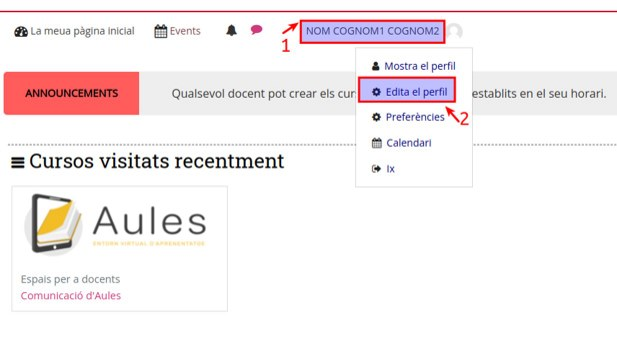
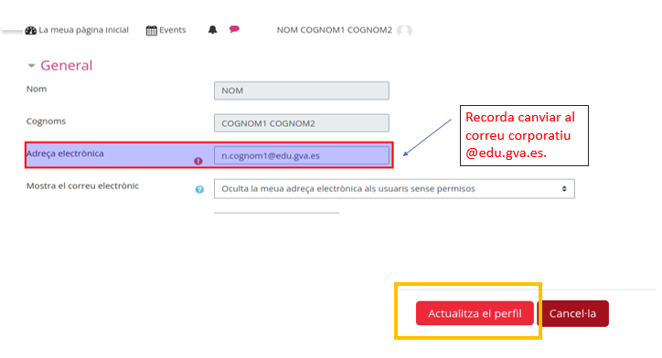

# Com sincronitzar Office365 amb Aules
## 1. Connectar amb Microsoft365
Per poder connectar necessitem tindre el correu corporatiu de conselleria al nostre perfil. 

Entrem en l'edició del perfil. 

 
 
Modifiquem el correu en cas de no tindre el corportatiu. 

