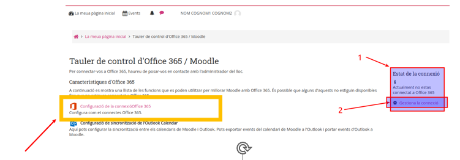
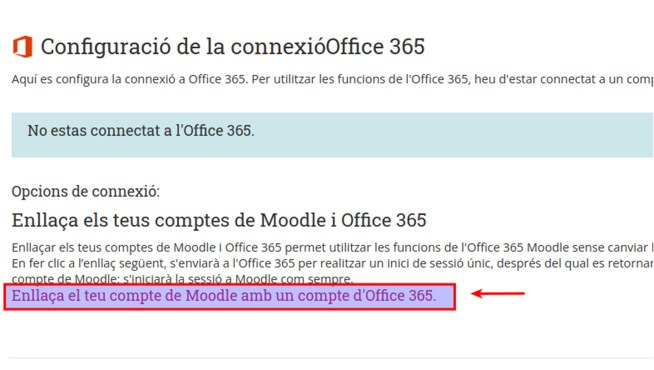
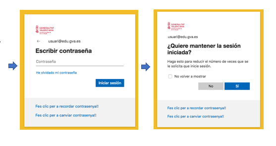
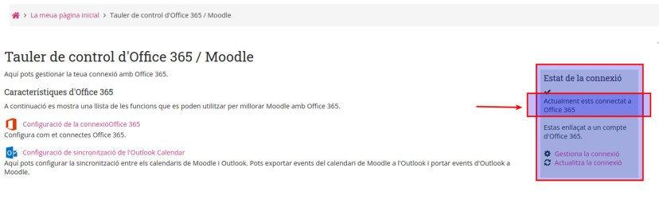
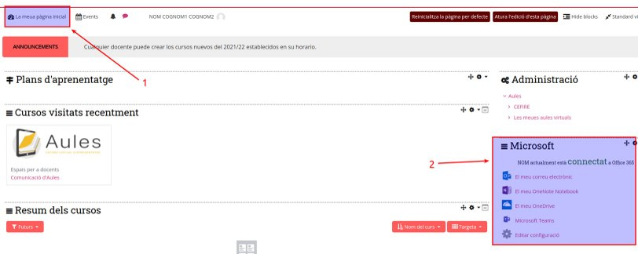

# Com sincronitzar Office365 amb Aules
## 1. Canviar l'adreça de correu
Per poder connectar necessitem tindre el correu corporatiu de conselleria al nostre perfil. 

Entrem en l'edició del perfil. 

 
 
Modifiquem el correu en cas de no tindre el corportatiu. 

En cas de haver realitzat el canvi, rebreu un correu per confirmar el canvi d'adreça de correu.

## 2. Mostrar el bloc de windows al la barra d'eines d'Aules

Per poder treballar en les ferarmentes d'Office 365, hem de mostrar el bloc de Microsoft. D'aquesta manera veurem els enllaços per accedir-hi. 

Una vegada realitzada la inclusió veurem que no estem conectats. 

## 3. Connectem a Office 365

Per poder connectar hem de clickar a  l'enllaç corresponent. 

Ara configurrem la connexió.

Acte seguit s'ha d'enllaçar el compte. 

### 3.1. Validació i connexió persistent

Ens identifiquem en les dades del conter de gva i decidim si volem que la connexió quede oberta.

### 3.2 Comprovar que ha sigut un éxit.

Podem comprovar que la connexió a sigut un éxit en la barra de lateral. 

## 4. Vista de les ferramentes al panell

Ara veiem els enllaços a les ferramentes d'aules.

